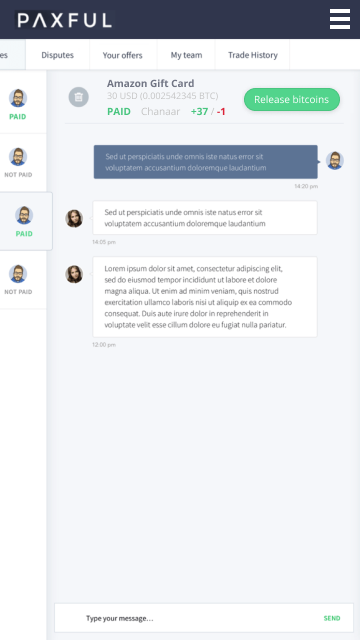

# Paxful Fullstack Developer Test Assignment

- [Project Goals](#project-goals)
- [Setup Guide](#setup-guide)
    - [Requirements](#requirements)
    - [Running the project](#running-the-project)
- [Used Technologies](#used-technologies)
- [Project Structure](#project-structure)
- [Architecture Decisions](#architecture-decisions)
- [TODO](#todo)

## Project Goals

1. Implement the "Sell bitcoins" page in React
1. Implement the Django API endpoint that will be used on this page
1. This page should be able to make a request to the API

## SetUp Guide

Instructions on how to run the project locally.

## Requirements

1. You will need a docker-compose & docker installed on your machine
    - https://docs.docker.com/install/
    - https://docs.docker.com/compose/install/
1. To use Makefile you will need https://www.gnu.org/software/make/ installed (or you can run docker-compose commands manually)

## Running the project

You can run commands directly to docker-compose or use GNU make tool to
run the same commands but with shorter keystrokes.

### With Makefile

> Use `make help` to see all available commands

1. `make setup` will build Docker containers and apply database migrations
1. `make` will start the containers
1. Visit http://127.0.0.1:3000 to see the resulting page

### Without Makefile

1. `docker-compose build` will build Docker containers
1. `docker-compose run --rm django python manage.py migrate` will apply migrations
1. `docker-compose up` will start the containers
    - The backend will be served on 8000 port
    - The frontend will be served on 3000 port
1. Visit http://127.0.0.1:3000 to see the resulting page

## Used Technologies

The project is built with these tools

- Docker
- Docker-Compose
- Django as backend
- PostgreSQL as database
- ReactJS as client
- Create-react-app to bootstrap the client application
- SASS as styles preprocessor

## Project Structure

```
├── client
│   ├── Dockerfile
│   ├── package.json
│   ├── public/
│   └── src
│       ├── pages/
│       ├── static/
│       ├── styles/
│       ├── trades/
│       ├── ui/
│       ├── index.js
│       ├── index.scss
│       └── App.js
├── server
│   ├── Dockerfile
│   ├── paxful
│   │   ├── migrations/
│   │   ├── models.py
│   │   ├── urls.py
│   │   └── views.py
│   ├── requirements.txt
│   ├── run.py
│   └── wait-for-it.sh
├── docker-compose.yml
├── Makefile
└── README.md
```

Project is separated to `client` and `server` applications, that has their
own containers configuration and dependencies.

UI components in client folder are stateless components that are responsible
only for representation of the content.

`wait-for-it.sh` script is used to wait for Postgres container to be available
for Django (because sometimes Django boots faster than the database).

## Architecture Decisions

1. **In the real-life situation we would use Redux** for managing application
    state, but in this small assignment it was easy to use Composition
    instead of Redux or drilling props
1. **In the real-life situation we would use Props Types**
    for validation, but in the scope of this project this was
    left for future improvements
1. **In the real-life situation we would use [Django Rest Framework](https://www.django-rest-framework.org/)**
    for API routing and serialization, but since the goal of the assignment
    was to implement only one route with a simple response, Django built-in
    `JsonResponse` was sufficient
1. **In the real-life situation we would evaluate if we need a CSS Framework**
    This is a process of deciding if time spent on overwriting framework
    styles will be less than time spent on building the design system
    tailored for the project-specific needs
1. CSS modules in our experience allow a more flexible approach to styling
    components, instant styles reload with HMR and smaller build size

## TODO

### Mobile friendly design

Next step will be to build a mobile-friendly version of the page.
Below is a concept of such a version:


